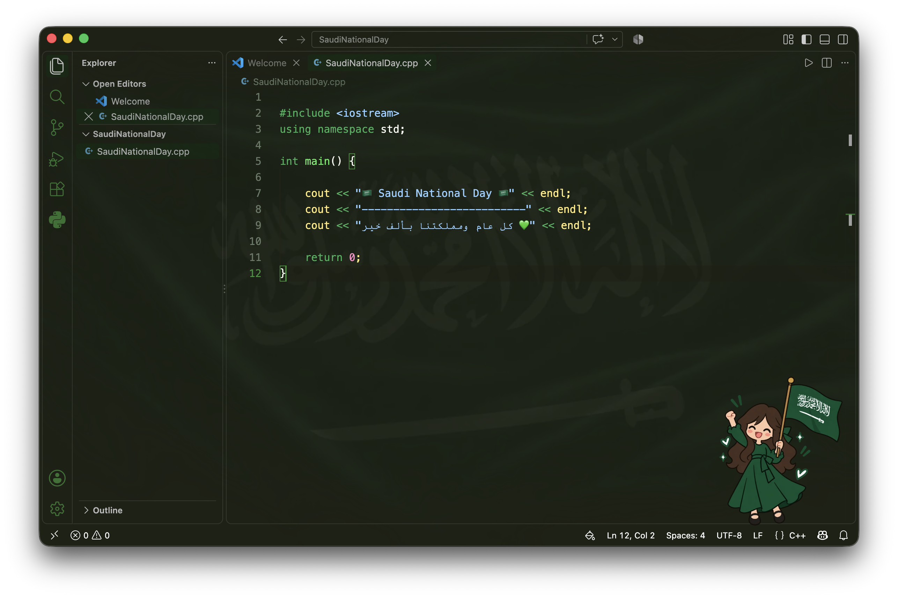

# 🇸🇦 Saudi National Day VS Code Theme

Celebrate Saudi National Day with a custom green VS Code theme featuring a Saudi flag background and adorable cartoon stickers!

Personalize your coding environment and celebrate the Saudi National Day in your own style. 💚

## ✨ Theme Preview



## 🎨 Choose Your Theme

Choose your favorite version!

### 👩 Girl Version


[Download Girl Theme](girl.css)

### 👨 Boy Version


[Download Boy Theme](boy.css)

Both versions feature:
- Saudi flag background
- Green color palette
- Custom cartoon sticker
- National Day-inspired design

## 🚀 Installation

### Step 1: Install the Extension

Open VS Code and install the **Custom CSS and JS Loader** extension.

### Step 2: Download Your Theme

Download your preferred CSS file from this repository:

- `girl.css` for the girl version.
- `boy.css` for the boy version.

Save the downloaded file somewhere on your computer.

### Step 3: Open VS Code Settings

Open the Command Palette:

- macOS: `Cmd + Shift + P`
- Windows: `Ctrl + Shift + P`

Search for:

`Preferences: Open User Settings (JSON)`

### Step 4: Add Your CSS File

Add the following setting to your `settings.json` file:

```json
"vscode_custom_css.imports": [
    "file:///YOUR/PATH/TO/girl.css"
]
```

Replace `YOUR/PATH/TO/girl.css` with the actual location of your downloaded CSS file.

If you prefer the boy version, use the path to `boy.css` instead.

### Step 5: Enable the Theme

Open the Command Palette and run:

`Enable Custom CSS and JS`

Restart VS Code when prompted.

Your Saudi National Day theme is ready! 🇸🇦

## 🔄 Switch Between Versions

To switch between the girl and boy themes:

1. Open VS Code Settings (JSON).
2. Replace the current CSS file path with the path to your preferred version.
3. Run `Reload Custom CSS and JS` from the Command Palette.
4. Restart VS Code if prompted.

## 📝 Notes

- VS Code may display a warning about a corrupted installation after enabling custom CSS. This warning can occur because the extension modifies VS Code's installation files.
- Custom CSS may need to be enabled again after updating VS Code.
- Only use CSS files from sources you trust.

## 📁 Included Files

| File | Description |
|------|-------------|
| `girl.css` | Girl version of the theme |
| `boy.css` | Boy version of the theme |
| `girl.png` | Girl cartoon sticker |
| `boy.png` | Boy cartoon sticker |
| `saudi_flag.png` | Saudi flag background |
| `preview.png` | Theme preview |

## 💚 Happy Saudi National Day!

Made with love for Saudi Arabia.

كل عام ومملكتنا بألف خير 🇸🇦

## 📄 License

This project is licensed under the MIT License. See the [LICENSE](LICENSE) file for details.
